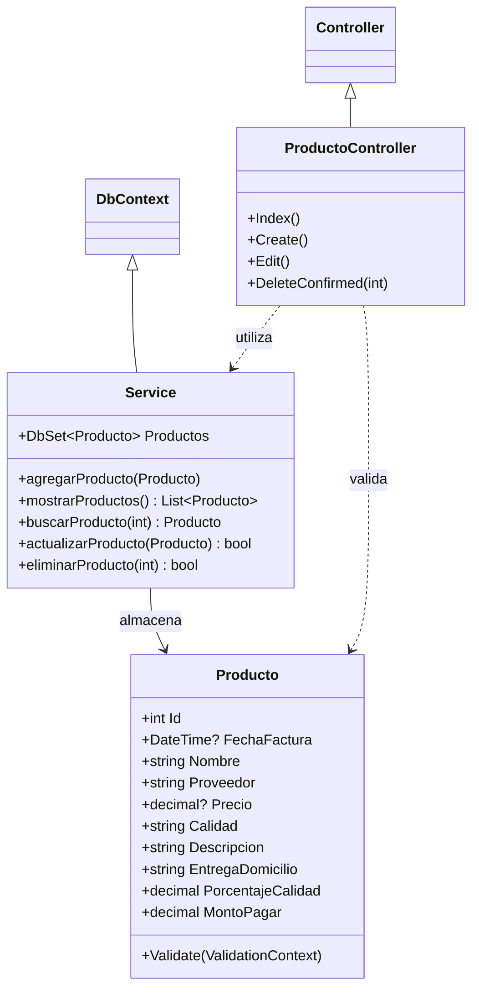

# Diagrama de clases UML

```mermaid
classDiagram
class Producto {
 +int Id
 +DateTime? FechaFactura
 +string Nombre
 +string Proveedor
 +decimal? Precio
 +string Calidad
 +string Descripcion
 +string EntregaDomicilio
 +decimal PorcentajeCalidad
 +decimal MontoPagar
 +Validate(ValidationContext)
}
class Service {
 +DbSet~Producto~ Productos
 +agregarProducto(Producto)
 +mostrarProductos() List~Producto~
 +buscarProducto(int) Producto
 +actualizarProducto(Producto) bool
 +eliminarProducto(int) bool
}
class ProductoController {
 +Index()
 +Create()
 +Edit()
 +DeleteConfirmed(int)
}
class DbContext
class Controller
DbContext <|-- Service
Controller <|-- ProductoController
Service --> Producto : almacena
ProductoController ..> Service : utiliza
ProductoController ..> Producto : valida
```